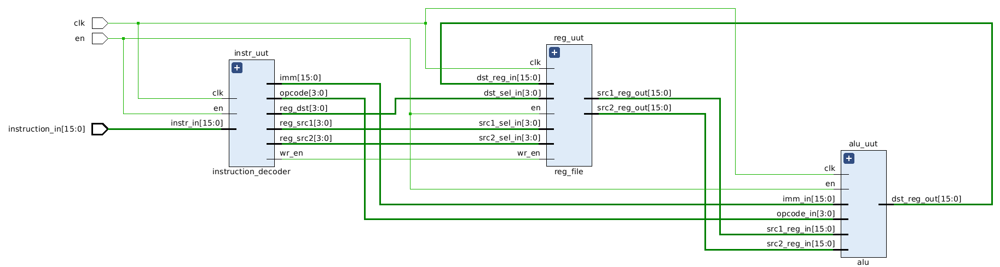
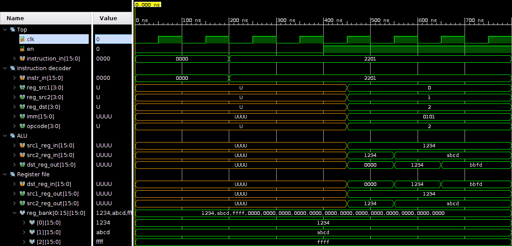

# HOMER
HOMER is an HOMEmade processoR with a custom 16-bit instruction set. The idea is to have fun with hardware processor development. An UART should be proposed as well.

## HOMER features

- [ ] 16 x 16-bit registers

## Instruction set and decoding

Foreseen minimal instruction set:

- [ ] `ADD`
- [ ] `SUB`
- [ ] `OR`
- [ ] `XOR`
- [ ] `AND`
- [ ] `NOT`
- [ ] `LOAD`
- [ ] `STORE`

At this moment, there are 8 instructions. The opcode could be encoded on 3 bits but I'll take a 4th bit for further instructions development. Here is the basic instruction format :

| Instruction        | 15-12    | 11-8      | 7-4        | 3-0        |
| ------------------ | -------- | --------- | ---------- | ---------- |
| RRR (i.e. `ADD`)   | `opcode` | `reg_dst` | `reg_src1` | `reg_src2` |
| Rrd (i.e. `NOT`)   | `opcode` | `reg_dst` | `reg_src1` | unused     |
| RImm (i.e. `LOAD`) | `opcode` | `reg_dst` | `Imm(7-4)` | `Imm(3-0)` |

### Opcodes

| Opcode | Instruction |
| ------ | ----------- |
| 0000   | ADD         |
| 0001   | SUB         |
| 0010   | OR          |
| 0011   | XOR         |
| 0100   | AND         |
| 0101   | NOT         |
| 0110   | LOAD        |
| 0111   | STORE       |
| 1000   | -           |
| 1001   | -           |
| 1010   | -           |
| 1011   | -           |
| 1100   | -           |
| 1101   | -           |
| 1110   | -           |
| 1111   | -           |

# 16/06/2020

Instructions can be decoded one by one. Only booleans instructions are supported for the moment.

