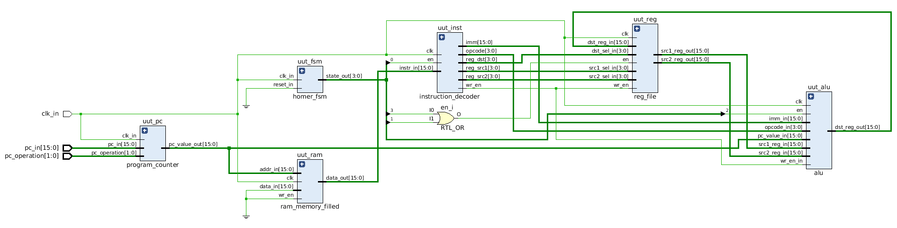
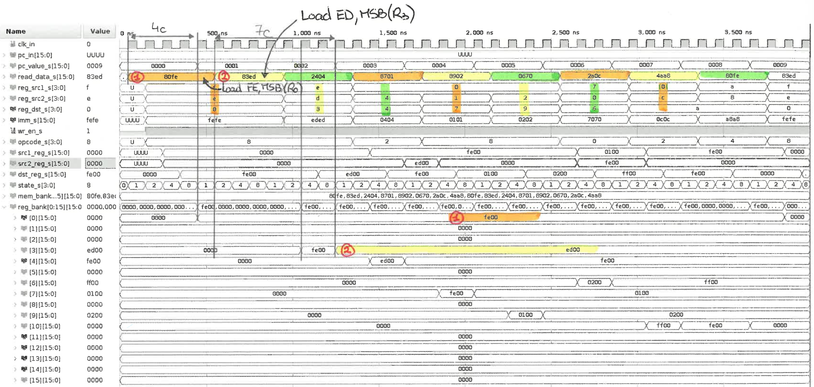

# HOMER
HOMER is an HOMEmade processoR with a custom 16-bit instruction set. The idea is to have fun with hardware processor development. An UART should be proposed as well.

This is mainly based on the tutorial available at: http://labs.domipheus.com/blog/category/projects/tpu/

## Instruction set and decoding

Here is the basic instruction format :

| Instruction        | 15-12    | 11-8      | 7-4        | 3-0        |
| ------------------ | -------- | --------- | ---------- | ---------- |
| RRR (i.e. `ADD`)   | `opcode` | `reg_dst` | `reg_src1` | `reg_src2` |
| Rrd (i.e. `NOT`)   | `opcode` | `reg_dst` | `reg_src1` | unused     |
| RImm (i.e. `LOAD`) | `opcode` | `reg_dst` | `Imm(7-4)` | `Imm(3-0)` |

### Opcodes

| Opcode | Instruction     | Implemented and validated |
| ------ | --------------- | ------------------------- |
| 0000   | ADD             | Done                      |
| 0001   | SUB             |                           |
| 0010   | OR              | Done                      |
| 0011   | XOR             | Done                      |
| 0100   | AND             | Done                      |
| 0101   | NOT             | Done                      |
| 0110   | Read            |                           |
| 0111   | Write           |                           |
| 1000   | Load            | Done                      |
| 1001   | Compare         | Done                      |
| 1010   | Shift L         | Done                      |
| 1011   | Shift R         | Done                      |
| 1100   | Jump            |                           |
| 1101   | Jump conditonal |                           |
| 1110   | -               |                           |
| 1111   | -               |                           |

## 24/06/2020

**First  (buggy) version of Homer !**

- The 1st instruction is decoded/executed in 4 cycles.
- Next instruction to be executed is the 5th one:
  - Due to the FSM, the instruction decoder is enabled every 4 cycles.
  - While other instructions are being read from the code memory, the current instruction is processed by Homer.
  - The result of the current instruction is written in the register file 3 cycles after decoding (i.e. when `state=2` or `state=8`).
- In other words, Homer seems to handle instructions as expected. Just need to manage the incoming instructions stream.

**Second (less buggy) version of Homer**

- The 1st instruction is decoded/executed in 4 cycles. It works as expected.
- 2nd instruction is the 2nd one in the code memory, same for the 3rd, the 4th... => this part now works as well!
  - I completely forgot to disable the program counter until the current instruction is executed...
- 2nd instruction (also a `load`) takes more cycles to be executed. Furthermore, there are 2 cycles where `reg3` (the destination register) is written with the value of the previous instruction (`fe00` while `ed00`, the correct value, is written in the following clock cycle).