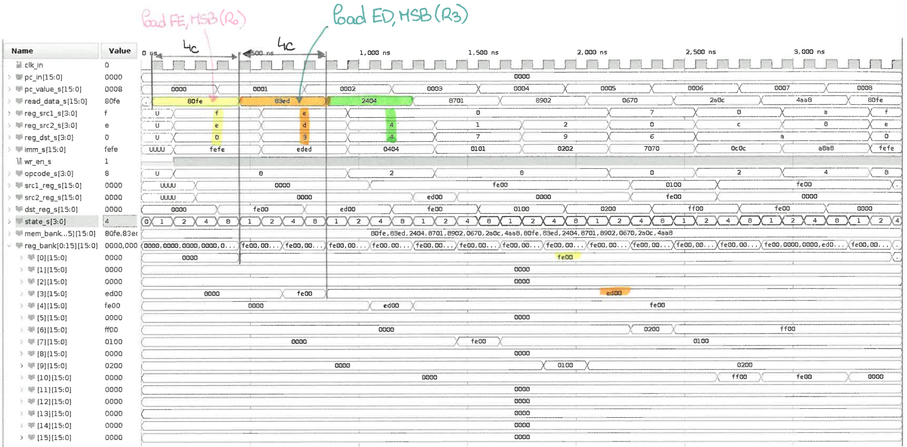
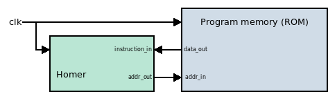

# HOMER
HOMER is an HOMEmade processoR with a custom 16-bit instruction set. The idea is to have fun with hardware processor development. An UART should be proposed as well.

This is mainly based on the tutorial available at: http://labs.domipheus.com/blog/category/projects/tpu/

> **Todo list**
> - [x] Writing a documentation for the ISA.
> - [x] Debugging the behavior of the 2nd instruction: it should not take so long.
> - [ ] Testing all instructions implemented in the ALU.
> - [x] Make it synthesizable.

## Buggy version of Homer

Issue [#1](https://github.com/pcotret/homer/issues/1) on the second instruction **fixed !**

However, this CPU cannot be synthesized... (see issue [#2](https://github.com/pcotret/homer/issues/2))

## Alpha version of Homer - Highly restricted ALU

In order to fix some issues, the ALU has been made as simple as I can. I will add instructions to the CPU later on.

- Program memory: 16 bytes (i.e.: 8 instructions)
- Memory mapping:
  - Program starts at address 0x00000000