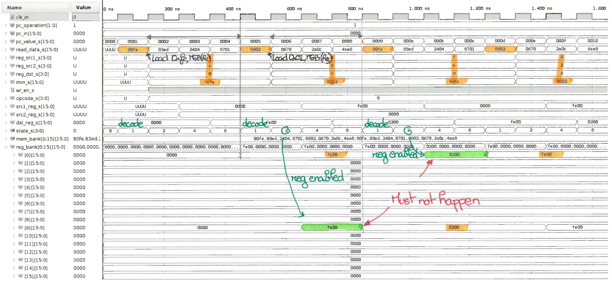

# HOMER
HOMER is an HOMEmade processoR with a custom 16-bit instruction set. The idea is to have fun with hardware processor development. An UART should be proposed as well.

This is mainly based on the tutorial available at: http://labs.domipheus.com/blog/category/projects/tpu/

> **Todo list**
> - [x] Writing a documentation for the ISA.
> - [x] Debugging the behavior of the 2nd instruction: it should not take so long.
> - [ ] Testing all instructions already implemented in the ALU.
> - [ ] Make it synthesizable.

## First  (buggy) version of Homer !

- The 1st instruction is decoded/executed in 4 cycles.
- Next instruction to be executed is the 5th one:
  - Due to the FSM, the instruction decoder is enabled every 4 cycles.
  - While other instructions are being read from the code memory, the current instruction is processed by Homer.
  - The result of the current instruction is written in the register file 3 cycles after decoding (i.e. when `state=2` or `state=8`).
- In other words, Homer seems to handle instructions as expected. Just need to manage the incoming instructions stream.

## Second (less buggy) version of Homer

- The 1st instruction is decoded/executed in 4 cycles. It works as expected.
- 2nd instruction is the 2nd one in the code memory, same for the 3rd, the 4th... => this part now works as well!
  - I completely forgot to disable the program counter until the current instruction is executed...
- Issue [#1](https://github.com/pcotret/homer/issues/1) on the second instruction **=> Fixed !**

## Third version of Homer

Issue [#1](https://github.com/pcotret/homer/issues/1) on the second instruction **fixed !**

Now, I need to verify the behavior of all instructions.

# Instructions
| Instruction             | Simulation OK ?    |
| ----------------------- | ------------------ |
| ADD                     |                    |
| SUB                     |                    |
| OR                      |                    |
| XOR                     |                    |
| AND                     |                    |
| NOT                     |                    |
| Read                    |                    |
| Write                   |                    |
| Load                    | :heavy_check_mark: |
| Compare                 |                    |
| Shift L                 |                    |
| Shift R                 |                    |
| Jump                    |                    |
| Jump conditonal         |                    |
| Reserved for future use |                    |
| Reserved for future use |                    |
